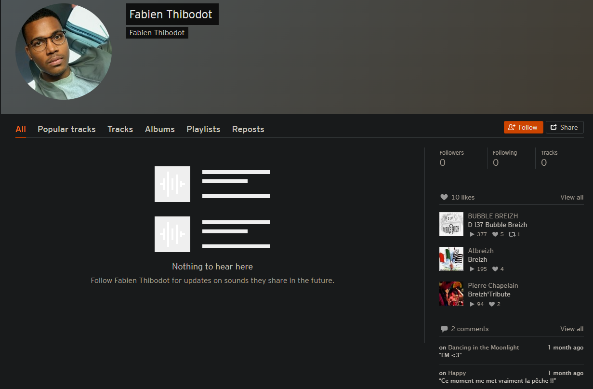

### Nombre de points : 30

### Auteur du challenge : @Erys

# Enoncé
Dans cette entreprise il y a plein de gars très bien, dont Fabien. Fabien c'est un gars bien. Il est cool et doux. Le genre de personne à aimer la nature.

Sauriez-vous découvrir l'itinéraire préféré de Fabien ? Pour ainsi l'accompagner dans des passionnantes ballades.

Format de flag : `UYBHYS{la route emprunté en entier numéro et nom}`

# Solution

Celui-ci était particulièrement vicieux, il faut savoir que nous avions précédemment trouvés sur le compte Twitter de Fabien Thibodot, sur lequel il avait partagé son profil Strava (Une plateforme utilisée pour enregistrer des activités sportives via GPS) ainsi qu'une photo montrant un paysage qu'il aime avoir en courant.

La piste la plus évidente dans un premier temps était d'utiliser ces élements là pour tenter de retrouver le chemin emprunté dans la photo étant donné que son profil Strava était vide mis à part le nom de la ville où il habite (La couyères). Cependant c'était une fausse piste.

2 élements étaient à remarquer pour trouver la suite :

- En cherchant son pseudo sur des moteurs de recherches autres de Google comme DuckDuckGo, Bing ou Qwant par exemple, on remarque un lien qui n'est pas présent sur Google. Il sagit du lien vers son profil Soundcloud.
- En regardant les comptes qu'il suit sur Twitter, on remarque qu'il suit Soundcloud, ce qui peut être une piste où un début de piste pour aller plus loin.

Bien que quasiment entièrement vide plusieurs élements doivent sauter aux yeux, les likes et les commentaires. Principalement les commentaires car sur Soundcloud les commentaires sont liés à un moment spécifique de la chanson et peuvent permettre de mettre en avant des paroles particulière ou des élements important.

Pas ici cependant, il suffisait de regarder les musiques likées pour voir `D 137 Bubble Breizh`, qui était finalement le flag.

# Flag

`UYBHYS{D137 Bubble Breizh}`