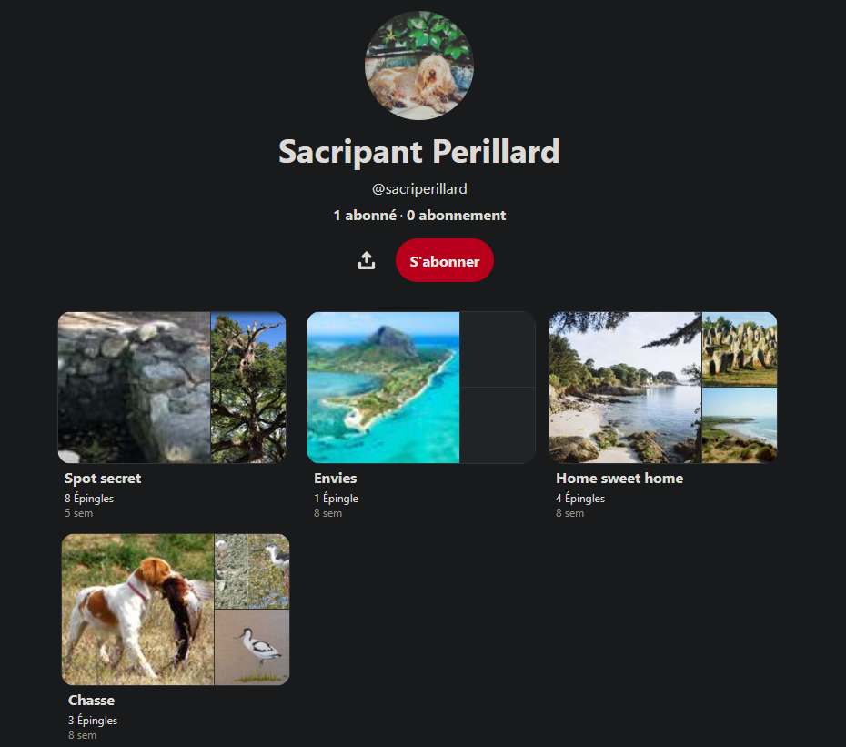
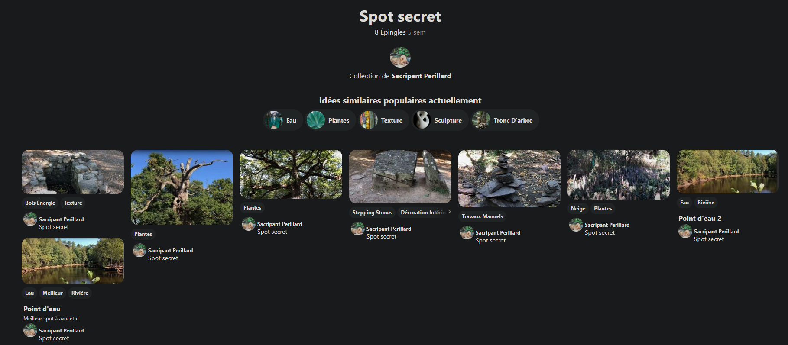

### Nombre de points : 20

### Auteur du challenge : @Erys

# Enoncé
C'est la pleine lune, le moment où les amoureux se tournent autour. Là il s'agit de chasse. C'est différent. Mais on peut aimer ce qu'on mange, vous ne pensez pas ? Il y a deux types de chasseur dans la vie. Le bon chasseur, et le mauvais chasseur. Je crois avoir oublié la suite...

Il paraît que monsieur Sacripant à un coin de chasse qu'il garde pour lui. Un coin secret. Trouvez la localisation de celui-ci. Je vous promets qu'il n'en saura rien !

Format de flag : `UYBHYS{Nom de la forêt}`

# Solution

Tout d'abord pour cela il fallait trouver le compte Pinterest de Sacripant Perillard. Etant indexé sur Google, une simple recherche à partir de son nom suffisait pour le trouver.

On peut donc remarquer le dossier Spot secret dans lequel se trouve.

Les connaisseurs le remarqueront à partir de quelques coups d'oeil, il sagit de la Forêt de Paimpont (alias Forêt de Brocéliandre) qu'on peut remarquer par certains élements connus comme la tombe de Merlin, la fontaine de barenton, ses Cairns (bien que trouvables à d'autres endroit, ça reste un élement emblématique du lieu), où encore d'autres élements plus spécifiques de la zone géographique.

Il etait aussi possible de les trouver la reverse image en cherchant suffisament ou encore en cherchant les forêts emblématique de Bretagne (risqué sans connaitre du tout).

La forêt est donc `la forêt de paimpont`.

# Flag

`UYBHYS{Paimpont}`