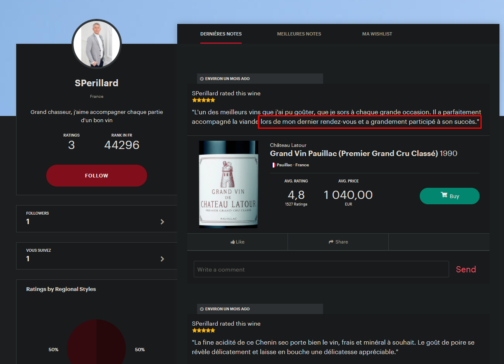
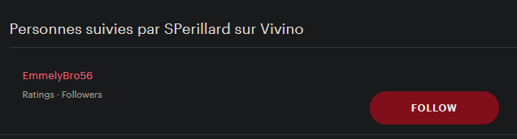

### Nombre de points : 40

### Auteur du challenge : @Erys

# Enoncé

Un bon repas est toujours accompagné d'un bon vin. Moi j'aime le vin, et j'aime la vie ! Les connaisseurs de bonnes bouteilles sont rares de nos jours. Ce sont souvent les générations passées qui ont le goût des bonnes choses.

Lors de vos investigations, vous avez découvert que les relations entre les différents membres de la Berzelius Corporation sont complexes... Et complexe, cela signifie complexe.

Indiquez le pseudo de la personne avec laquelle Sacripant a partagé un bon repas ?

Format de flag : `UYBHYS{Pseudo}`

# Solution

Pour ce challenge, l'énoncé était plus important pour sa résolution que les élements déjà connus.

Il faut savoir que plusieurs réseaux sociaux autour du vin existe, et tout particulièrement un français du nom de Vivino. Ces réseaux permettent de partager des vins et de donner des avis dessus.

En cherchant plusieurs alias de Sacripant sur la plateforme (`sacripant.perillard`, `SPerillard1` (comme Twitter), ou `SPerillard`), on fini par tomber dessus avec le pseudo `sperillard`

Le compte suit une personne, et il sagit de `EmmelyBro56`, ce qui rappelle Emmelyne Brodeur l'Hapiness Manager de Berzelius Corportation.

# Flag

`UYBHYS{EmmelyBro56}`