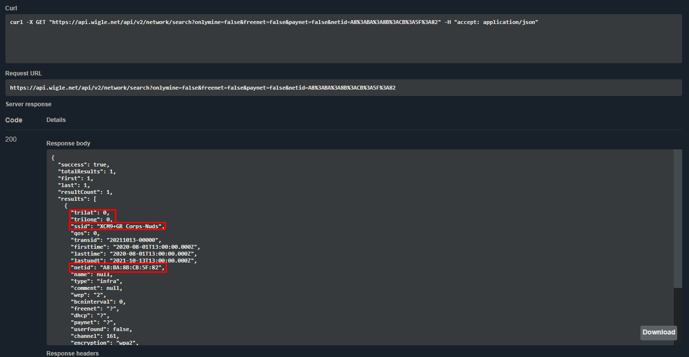
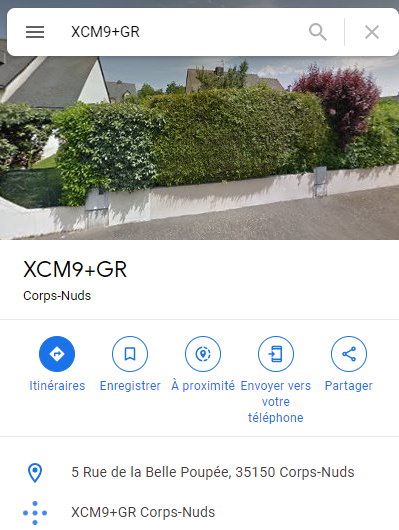

### Nombre de points : 30

### Auteur du challenge : @Raven

# Enoncé
Vous décidez de vous rendre au café un jeudi soir, point de rencontre habituel des membres du groupuscule pour essayer d'en apprendre plus. Le café était vide, les auteurs ont disparu avant que vous ne puissiez intervenir. L'une des personnes, dans sa fuite précipitée a oublié un AirTag sur place. Après plusieurs investigations sur l'objet, votre ami Georges (adepte du forensic lors de son temps libre) parvient à obtenir une adresse MAC : A8:BA:8B:CB:5F:82. Il semblerait qu'il s'agisse de l'adresse MAC de l'IPhone auquel est relié l'AirTag. Il est possible que cette adresse nous mène vers l'endroit où les voleurs cachent le camion et les produits chimiques.

A partir de ces informations, trouvez cette adresse postale.

Format de flag : `UYBHYS{Adresse du local}`

# Solution

Ce chall était plus complèxe et a fait se tirer les cheveux de pas mal de personnes à cause de légère subtilité.

En voyant l'adresse mac, la majorité des gens se sont directement tournés vers le site WiGLE qui fait du mapping collaboratif de réseau public et qui permet de chercher par adresse MAC. Cependant en rentrant l'adresse mac dans l'outil de recherche, aucun réseau n'était retourné.

Cela est dû a une spécificité de WiGLE, les réseaux sans localisation (latitude & longitude) ne sont pas renvoyé dans les résultats de recherche, cependant ils sont renvoyés en passant par l'API.

L'API nous renvoi le nom de réseau XCM9+GR Corps-Nuds.

Corps-Nuds est une commune française et XCM9+GR ressemble beaucoup au code de location généré par Google. On peut donc chercher cet ensemble directement sur Google pour trouver l'adresse du local.

L'adresse est donc `5 Rue de la Belle Poupée`.

# Flag

`UYBHYS{5 Rue de la Belle Poupée}`