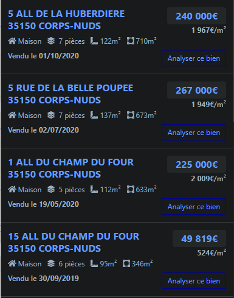

### Nombre de points : 40

### Auteur du challenge : @Madame_Https

# Enoncé
Vous avez réussi à géolocaliser l'endroit où les produits chimiques ont été entassés. Les auteurs du vol ont presque tous été interpellés grâce à votre signalement. Une partie des produits chimiques a été récupérée. Pour autant, tout n'est pas terminé. De nouvelles investigations s'ouvrent à présent. Une information vous a été signalée, indiquant que la vente immobilière de la demeure que vous avez trouvez dans votre précédente investigation, avait servi à payer l'association des avocettes.

Quel est le montant de la vente de ce bien, réalisée en 2020 ?

Format de flag : `UYBHYS{Montant}`

# Solution

En cherchant `"5 Rue de la Belle Poupée"` sur Google et en se balandant dans les plusieurs pages Google on fini par tombé sur le site [Immo-data](https://www.immo-data.fr/) qui nous propose de consulter les ventes réalisées dans cette rue.

On y trouve la vente de la maison au 5 Rue de la Belle Poupée : 

Le prix de vente est donc `267000€`

# Flag

`UYBHYS{267000€}`