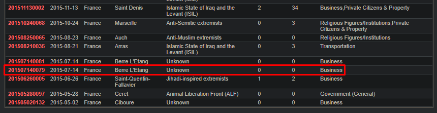

### Nombre de points : 50

### Auteur du challenge : @Madame_Https

# Enoncé
L'image trouvée sur le site semble faire clairement référence à un évènement ou à une attaque terroriste s'étant déjà produite en France. La police souhaite collecter davantage d'informations via votre précieuse aide, afin de déjouer cette attaque rapidement.

Analysez les éléments fournis dans cette image dans un premier temps. Puis déterminez la ville où s'est déroulée l'attaque qui a inspiré l'Ordre des Avocettes.

Format de flag : `UYBHYS{Nom de la commune}`

# Solution

En cherchant sur l'image on remarque qu'il est indiqué que la maquette est inspiré de l'évenement numéro `201507140079` du `GTD`.

En cherchant ce numéro sur google, on fini par tomber sur le site https://start.umd.edu/gtd qui est celui de la `Global Terrorism Database` dont le logo correspond au logo sur le document.

On apprend donc que cette attaque à eu lieu à `Berre L'Etang` en France.

# Flag

`UYBHYS{Berre L'Etang}`