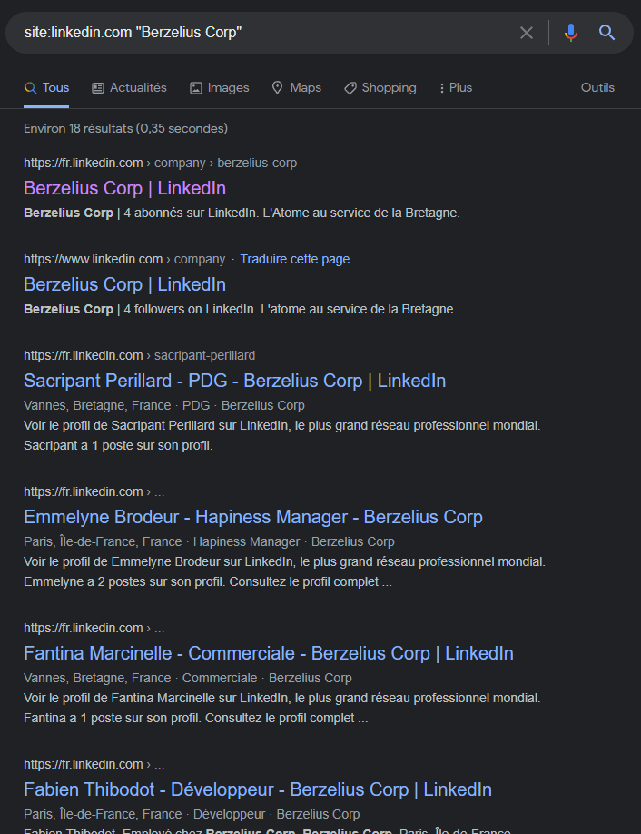

### Nombre de points : 10

### Auteur du challenge : @Erys

# Enoncé
Le lundi matin à 9h, vous avez encore la tête dans le cul. Votre café est tiède. Votre concierge a encore joué de la musique toute la nuit. Vous arrivez à votre agence de détective privé l'air dépité et fatigué. Le téléphone sonne. Cette douce musique vous rappelle que vous êtes un boomer avec un téléphone fixe. Vous répondez et découvrez une petite voix fluette. Il s'agit de Monsieur Sacripant PERILLARD, PDG de la société Berzelius Corp. Celui-ci est littéralement en panique. Il hurle sur vous pour que vous veniez l'aider. Sans trop comprendre de quoi il retourne, vous vous dirigez avec votre imperméable vert en direction de la société Berzelius Corp, célèbre usine de produit chimique. Cette histoire semble louche, mais elle paye les factures.

Vous profitez du trajet sous la pluie (normal en Bretagne) pour vous renseigner un peu sur la société Berzelius.

Le flag est la concaténation des prénoms de tous les employés de la société, classés dans l'ordre alphabétique (sans le prénom du PDG).

Format de flag : `UYBHYS{PrenomPrenom...}`

# Solution

En cherchant `"Berzelius Corp"` sur Google on tombe en premier sur [le compte LinkedIn de l'entreprise](https://www.linkedin.com/company/berzelius-corp/).

Dans l'onglet people de cette page, on remarque qu'il y a 4 salariés de l'entreprise mais que leur profils ne sont pas visible et leur nom caché en "LinkedIn Member".

On peut donc utiliser une google dorks pour récupérer la liste de ces salariés : `site:linkedin.com "Berzelius Corp"`

En excluant le PDG (Sacripant Perillard), les prénoms des salariés sont donc Emmelyne, Fabien et Fantina

# Flag

`UYBHYS{EmmelyneFabienFantina}`