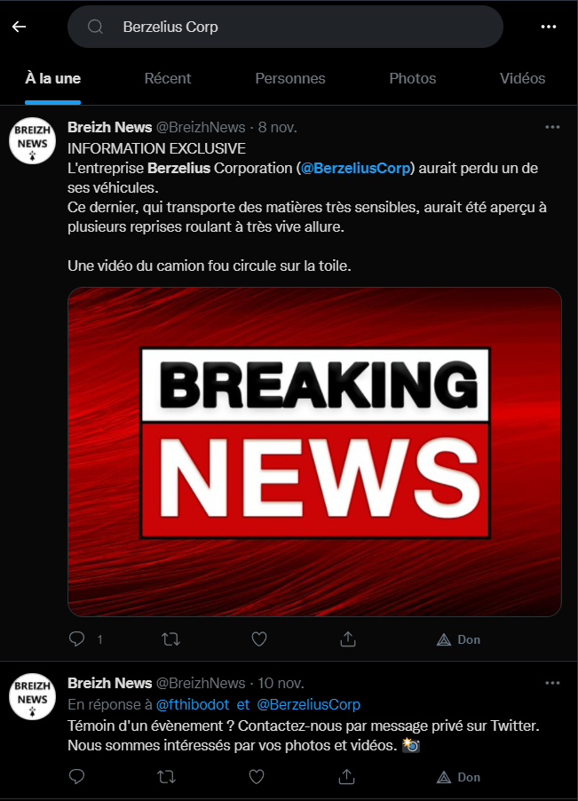

### Nombre de points : 10

### Auteur du challenge : @Raven

# Enoncé
Le PDG de Berzelius Corp vous explique qu'un de leurs camions contenant des produits chimiques a disparu, probablement volé. Il a essayé de garder l'information secrète mais celle-ci a déjà fuité sur les réseaux, à cause d'un compte anonyme.

Trouvez l'identifiant du compte qui a révélé l'information sur un réseau social.

Format de flag : UYBHYS{AliasDuCompte}

# Solution

En général l'un des premiers réseau pour chercher ce genre d'informations est Twitter. En cherchant `Berzelius Corp` sur Twitter, on tombe sur un tweet de `@BreizhNews` indiquant que l'entreprise Berzelius Corporation aurait perdu un de ses véhicules. 

Le nom du compte est donc BreizhNews

On peut aussi remarquer dans les commentaires du tweet principal la réponse d'un salarié de l'entreprise, Fabien Thibodot qui indique le camion est passé dans son village, une information qui servira sûrement plus tard.

# Flag

`UYBHYS{BreizhNews}`