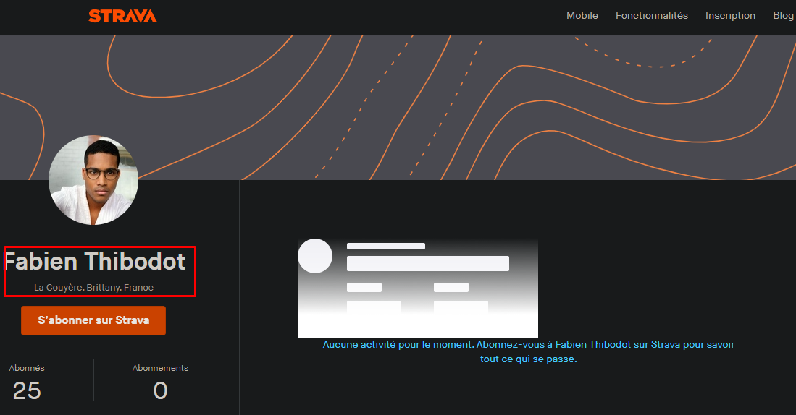

### Nombre de points : 10

### Auteur du challenge : @DaftRock

# Enoncé
Pendant vos investigations sur les réseaux, vous êtes avertis que des témoins ont filmé le camion de la société dans une petite ville de France.

Une vidéo du camion circule sur la toile, sur un réseau social pour les spécialistes modernes de la phonéographie. Trouvez la ville dans laquelle est passée le camion.

Format de flag : `UYBHYS{Ville}`

# Solution

Avec les informations trouvée précédemment, on ne peut que repenser a Fabien Thibodot qui a vu passer le camion dans sa ville. On peut peut être retrouver la ville dans laquelle il habite.

En allant sur son compte Twitter on trouve un tweet ou il donne le lien de son profil Strava.

Sur son profil on peut voir qu'il habite à La Couyères. C'est donc le nom de la ville demandé.

# Flag

`UYBHYS{La Couyères}`