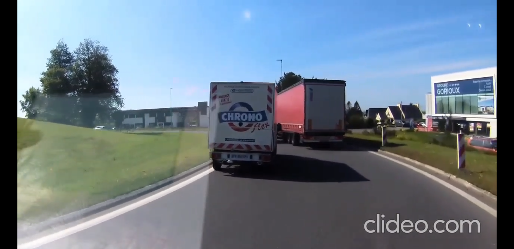
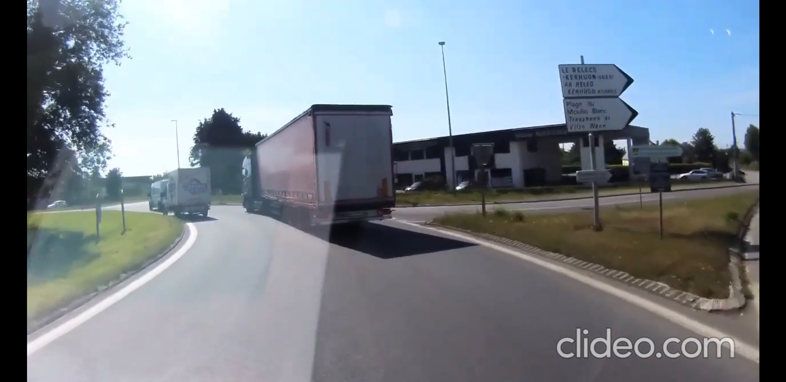
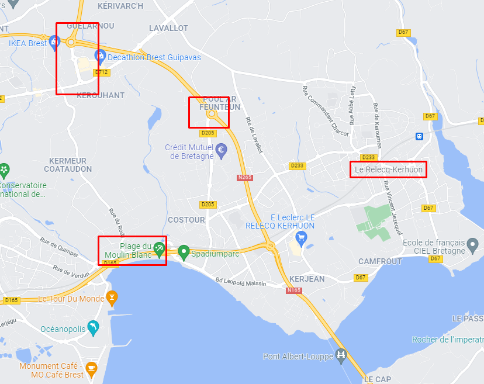

### Nombre de points : 20

### Auteur du challenge : @Madame_Https

# Enoncé
Vous avez au cours des premières recherches identifié la ville par laquelle est passé le camion. Afin d'en savoir plus sur les conditions du vol, vous débutez des recherches avancées. Il vous ait rapporté que les voleurs du camion ont été aperçus dans une boulangerie à quelques pas de l'endroit où le camion a été filmé.

La vidéo complète du challenge précédent est en PJ. Trouvez dans un premier temps le nom de la boulangerie. Quel est le nom de l'ancien co-gérant de cette enseigne ?

Format de flag : `UYBHYS{Nom}`

___Une vidéo nous a été fournie dans le cadre de ce challenge, étant donné qu'elle ne sera plus forcément disponible, le writeups sera écrit en reprenant les élements de la vidéo.___

# Solution

On peut remarquer sur cette photo le batiment "Groupe Gorioux" à droite.

On peut remarquer sur cette photo plusieurs panneau vers "La plage du moulin blanc" et "Le belecq"

À partir de ces éléments, on peut tenter de retrouver le rond point où a été prise la vidéo avec google maps.

On a pu limiter les possibilités a ces rond points étant donné la taille du rond point et le fait que le RELECQ-KERHUON et La plage du Moulin Blanc soit sur la même sortie du rond-point, ce qui fait que ça n'aurait pas pu être le rond-point un peu plus bas a coté du Leclerc.

Après avoir regarder le plus gros sur google maps (le central a coté du Crédit Mutuel), les bâtiments ont correspondus à l'emplacement de la vidéo.

La ville était donc Guipavas.

# Flag

`UYBHYS{Guipavas}`