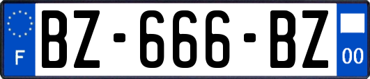
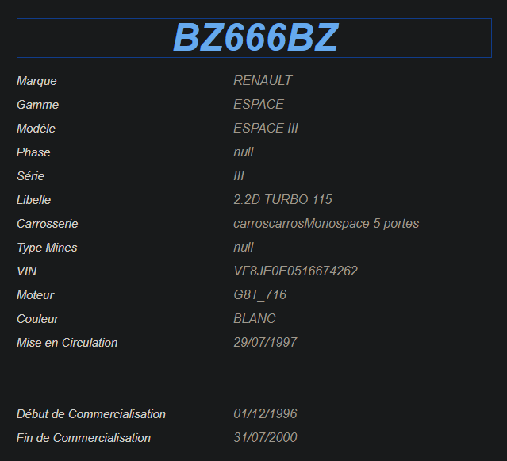

### Nombre de points : 20

### Auteur du challenge : @Erys

# Enoncé
Maintenant que le camion est localisé, vous vous rendez sur le parking de la boulangerie afin d'en apprendre un peu plus sur les circonstances du vol. Cependant, lorsque vous arrivez sur les lieux, vous constatez que la plaque d'immatriculation du camion a été échangée avec une autre. Le ou les voleurs ont sans doute voulu brouiller les pistes et vous empêcher de remonter jusqu'à eux.

Trouver le modèle du véhicule liée à la nouvelle plaque, ainsi que son année de mise en circulation.

Format de flag : `UYBHYS{MarqueAnnée}`

# Solution

Pour récuperer les informations sur la plaque j'ai utilisé le site siv-auto.fr.

La marque est donc Renault et l'année de mise en circulation 1997.

# Flag

`UYBHYS{Renault1997}`