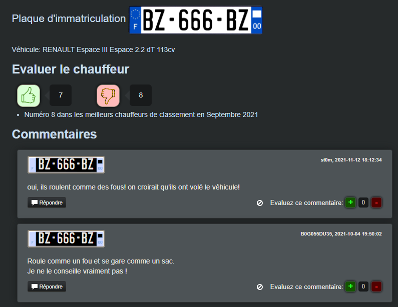

### Nombre de points : 20

### Auteur du challenge : @Raven

# Enoncé
Vous commencez vos recherches pour essayer de trouver des informations relatives à la plaque d'immatriculation nouvellement apposée sur le camion. Il est possible que la nouvelle plaque soit celle du véhicule personnel de l'un des auteurs du vol. Évidemment, vous n’avez pas accès aux fichiers détaillant les informations sur le propriétaire du véhicule. Cela vous importe peu. Ce véhicule a été vu et signalé à de nombreuses reprises sur le net.

Trouvez les signalements liés à cette plaque, un alias appartenant à l'un des voleurs y apparait.

Format de flag : `UYBHYS{Alias}`

# Solution

En cherchant `"BZ-666-BZ"` sur Google on tombe sur le site evaluer-chauffeur.fr, une fois deçu on peut chercher des avis par plaque d'immatriculation : Ici `BZ-666-BZ`.

On peut voir ici 2 commantaires, au moment de faire le challenge il n'y en avait qu'un, le dernier message à été rajouté par un participant.

Le commentaire en question est donc celui de `B0G055DU35`

# Flag

`UYBHYS{B0G055DU35}`