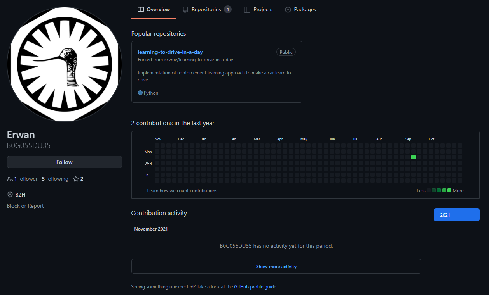
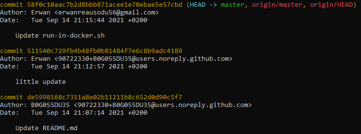

### Nombre de points : 20

### Auteur du challenge : @DaftRock

# Enoncé
A present, il vous est possible de trouver le compte de l'un des auteurs du vol sur un service web d'hébergement de développement de logiciels.

Quelle adresse mail est liée à ce compte ?

Format de flag : `UYBHYS{adressemail}`

# Solution

En cherchant le pseudo B0G055DU35 sur Github, on tombe bien sur un profil existant.

Ce profil a 3 commits récent dans un repo, étant donné que le but du challenge est de récupérer son adresse mail, on a cloner le repo pour regarder les logs des commits qui affichent une adresse mail, soit rentré par l'utilisateur (ce qui nous intéresserait), soit généré automatiquement par Github (Dans le cadre de commit Github).

On peut voir sur ce screen les 3 commits, et voir que l'utilisateur a rentré son adresse mail pour le dernier commit qu'il a fait.

Son adresse mail est donc `erwanreausodu56@gmail.com`

# Flag

`UYBHYS{erwanreausodu56@gmail.com}`