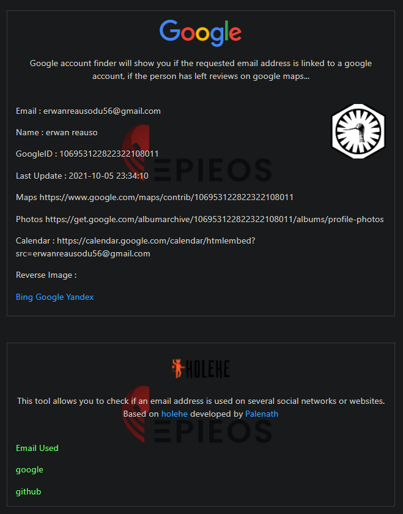
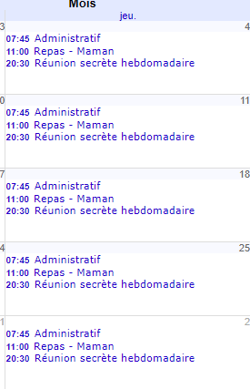

### Nombre de points : 30

### Auteur du challenge : @Madame_Https

# Enoncé
Fort de ces nouveaux éléments, vous décidez d’investiguer sur l’adresse mail de l’individu responsable du vol du camion de Berzelius Corp. Il semblerait qu'il soit un membre notoire d'un groupuscule écolo-extrémistes, ayant l'habitude de se réunir secrètement de manière hebdomadaire.

Trouvez le nom de ce groupuscule avec lequel l'individu semble se réunir d'après son mémorandum personnel involontairement accessible à tous.

Format de flag : `UYBHYS{Nom du groupe}`

# Solution

Etant donné que l'adresse récupérer précédémment est une adresse gmail, on peut utiliser l'outil [EPIEOS](https://tools.epieos.com/email.php) pour regarder les informations laissée publique sur ce compte Google.

Parmis ces informations il y a ses avis Google maps ainsi que son Google Calendar. Le google photos est malheureusement privé ou vide.

_On peut d'ailleur remarquer que Holehe nous confirme que l'adresse mail est bien celle utilisée pour le compte Github_.

À partir de son Google Calendar, on trouve des `réunions secrètes` qui ont comme description : `Réunion avec les confrères de l'ordre des avocettes (7 Pl. Sainte-Anne, 35000 Rennes, France)`

Le nom du groupe est donc `ordre des avocettes`

# Flag

`UYBHYS{ordre des avocettes}`